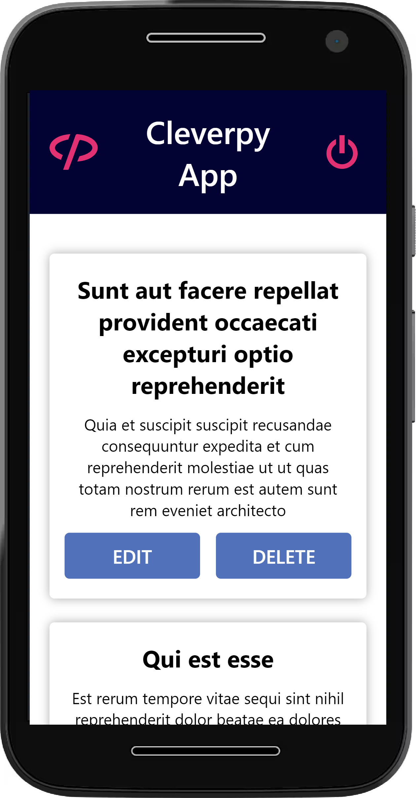
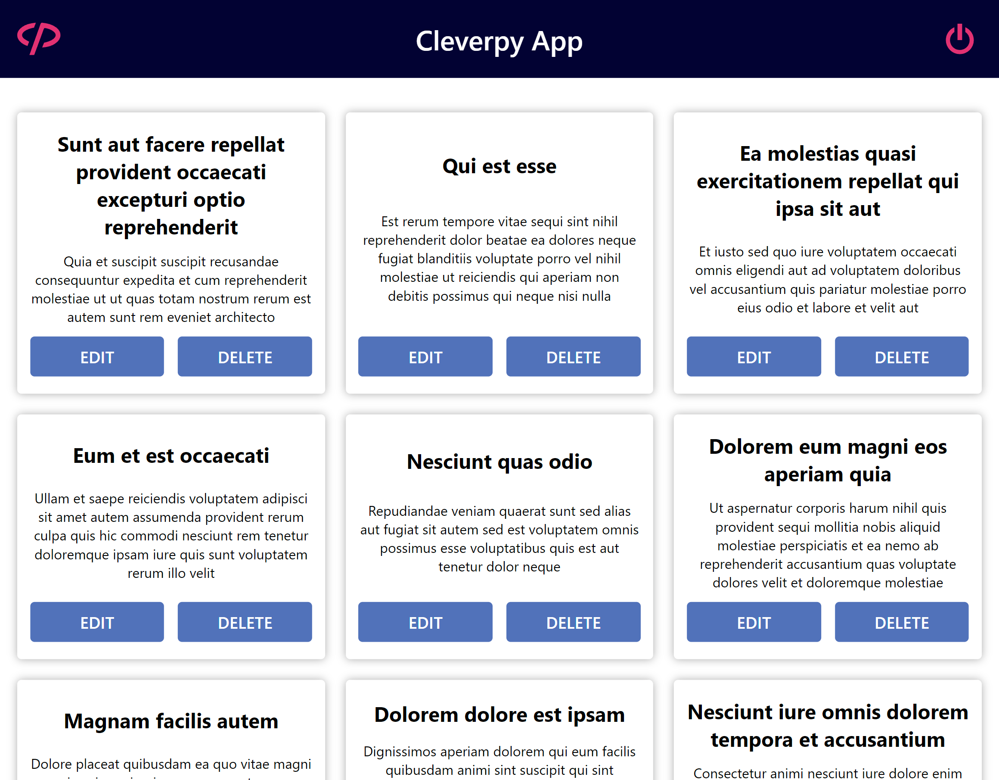

.

# 📑 Cleverpy App

> Web application represent the returned posts

 </br>

# 💫Getting Started

**Install NPM packages**

```sh
npm install
```

**Run the project**

```sh
npm start
```

- Then will open [http://localhost:3000](http://localhost:3000)

<br/>

**Login Credentials **

```sh
- Usuario: admin
- Contraseña: admin
```

<br/>

**Run the test**

```sh
npm test

npm run cypress:open
```

<br/>

# 🎨Screenshots

<div align="center" >

 
  &nbsp  &nbsp &nbsp  &nbsp
 
</div>

<br/>

# 🎞️ Video Cypress

[](https://youtu.be/6HEEULa6qdo)

<br/>

# 💻 Stack

- [React.js](https://nextjs.org/)
- [Redux Toolkit](https://redux-toolkit.js.org/)
- [TypeScript](typescriptlang.org)
- [Styled-Components](https://styled-components.com/)
- [Jest](https://jestjs.io/)
- [Testing-Library](https://testing-library.com/)
- [Cypress](https://www.cypress.io/)
